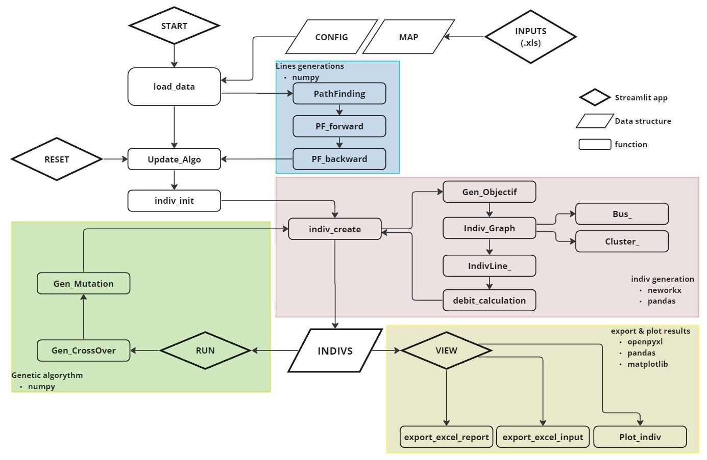

# Project Title

## Table of Contents

- [About](#about)
- [Getting Started](#getting_started)
- [Usage](#usage)

## About <a name = "about"></a>

This tool was developed to simulate via a genetic algorithm the optimal configuration of a fluid network from the pump to the nozzles. This tool use as a user interface a dashboard executed by the streamlit framework, the formal representation of the network is managed by networkx as well as the graph optimization.

## Getting Started <a name = "getting_started"></a>

These instructions will get you a copy of the project up and running on your local machine for development and testing purposes.

### Prerequisites


```
openpyxl : excel import / export 
XlsxWriter : excel import / export 
matplotlib : figure
networkx : indiv graph
streamlit : app
```

### Runnnig

in a terminal run following command line 

```
streamlit run main.py
```


## Usage <a name = "usage"></a>

The program has 2 distinct parts:
 - main.py contains the code for the app streamlit.
 - utils.py contains the calculation code and utilities. 
 
 for a better understanding the following figure details the interactions between the functions, the color code corresponds to a specific section of the calculation, the knowledge required to modify these sections (libraries) are also listed. 


